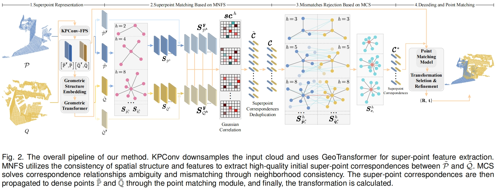

# 📃 DMS: Low-overlap Registration of 3D Point Clouds with Double-layer Multi-scale Star-graph

[DMS: Low-overlap Registration of 3D Point Clouds with Double-layer Multi-scale Star-graph](https://ieeexplore.ieee.org/document/10530423).

[Hualong Cao](https://scholar.google.com/citations?user=Vh-QasEAAAAJ), [Yongcai Wang](https://in.ruc.edu.cn/yjdw_yc/js/ycw.html), and Deying Li.

## Pipline


# 🛠️ Setup
The code has been tested on:

- Ubuntu 20.04 LTS, Python 3.8.0, CUDA 11.6, torch1.7.1+cu110, GeForce RTX 3090

## 💻 Installation

Please use the following command for installation.

```bash
# It is recommended to create a new environment
conda create -n dms python==3.8
conda activate dms
pip install torch==1.7.1+cu110 -f https://download.pytorch.org/whl/torch_stable.html

# Install packages and other dependencies
pip install -r requirements.txt
python setup.py build develop
```

## 📦 Data Preparation

### 3DMatch

The dataset can be downloaded from [PREDATOR](https://github.com/prs-eth/OverlapPredator). The data should be organized as follows:

```text
--data--3DMatch--metadata
              |--data--train--7-scenes-chess--cloud_bin_0.pth
                    |      |               |--...
                    |      |--...
                    |--test--7-scenes-redkitchen--cloud_bin_0.pth
                          |                    |--...
                          |--...
```

### Kitti odometry

Download the data from the [Kitti official website](http://www.cvlibs.net/datasets/kitti/eval_odometry.php) into `data/Kitti` and run `data/Kitti/downsample_pcd.py` to generate the data. The data should be organized as follows:

```text
--data--Kitti--metadata
            |--sequences--00--velodyne--000000.bin
            |              |         |--...
            |              |...
            |--downsampled--00--000000.npy
                         |   |--...
```

### ModelNet

Download the [data](https://shapenet.cs.stanford.edu/media/modelnet40_ply_hdf5_2048.zip) and run `data/ModelNet/split_data.py` to generate the data. The data should be organized as follows:

```text
--data--ModelNet--modelnet_ply_hdf5_2048--...
               |--train.pkl
               |--val.pkl
               |--test.pkl
```

### 4DMatch

Download the [data](https://drive.google.com/file/d/1YoHWhVaH5Yyo1gTjybiuaODA1lZrM_nG/view?usp=sharing). The data should be organized as follows:

```text
--data--4DMatch
               |--train--abe_CoverToStand--cam1_0000_cam2_0006.npz
               |      |               |--...
               |      |--...
               |--test--amy_Situps--cam1_0000_cam2_0003.npz
                      |                    |--...
                      |--...
```

## 🚀 Running

### Training

The code is in `experiments/exp`. Use the following command for training.

```bash
CUDA_VISIBLE_DEVICES=0 python trainval.py
```


## 🎡 Multi-GPU Training

As the point clouds usually have different sizes, we organize them in the *pack* mode. This causes difficulty for batch training as we need to convert the data between *batch* mode and *pack* mode frequently. For this reason, we limit the batch size to 1 per GPU at this time and support batch training via `DistributedDataParallel`. Use `torch.distributed.launch` for multi-gpu training:

```bash
CUDA_VISIBLE_DEVICES=GPUS python -m torch.distributed.launch --nproc_per_node=NGPUS trainval.py
```

Note that the learning rate is multiplied by the number of GPUs by default as the batch size increased. In our experiments, multi-gpu training slightly improves the performance.

## 🎓 Citation

```bibtex
@ARTICLE{DMS,
  author={Cao, Hualong and Wang, Yongcai and Li, Deying},
  journal={IEEE Transactions on Visualization and Computer Graphics}, 
  title={DMS: Low-overlap Registration of 3D Point Clouds with Double-layer Multi-scale Star-graph}, 
  year={2024},
  volume={},
  number={},
  pages={1-16},
  doi={10.1109/TVCG.2024.3400822}
}

```

## ✏️ Acknowledgements

- [GeoTransformer](https://github.com/qinzheng93/GeoTransformer)
- [Maximal-Cliques](https://github.com/zhangxy0517/3D-Registration-with-Maximal-Cliques)
- [PREDATOR](https://github.com/prs-eth/OverlapPredator)
- [CoFiNet](https://github.com/haoyu94/Coarse-to-fine-correspondences)
